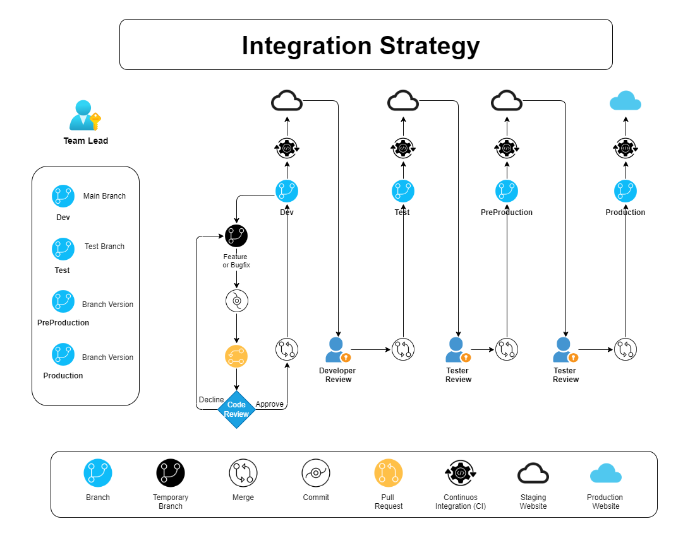
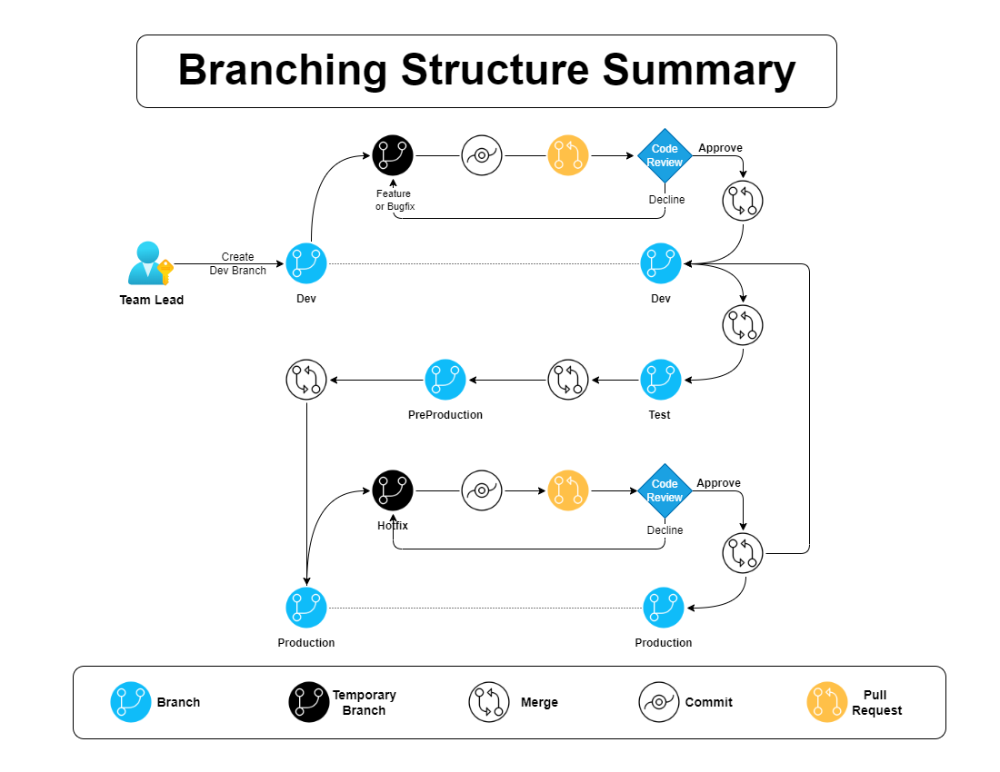
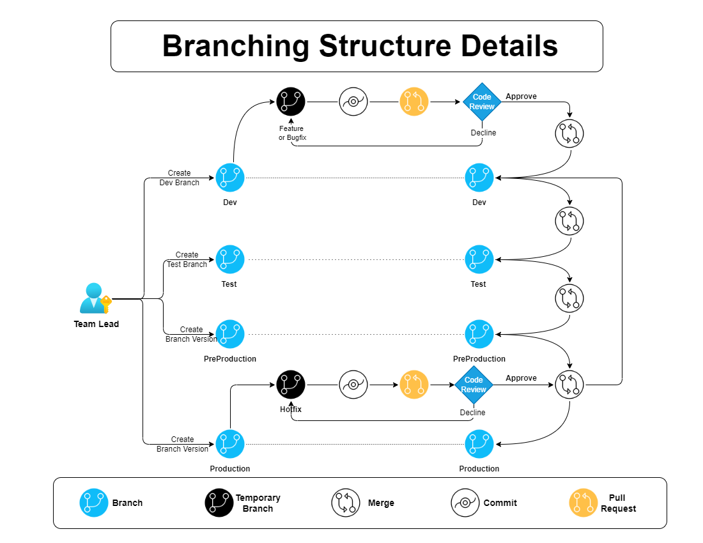

# Branching and Integration Strategy

### **1. Project Initialization**

- **Repository Creation**: Start by setting up a new project repository for source code management.
- **Primary Branch Setup**: The Team Leader establishes the following branches to streamline development:
  - **Development Branch**: For ongoing development work.
  - **Test Branch**: Dedicated to testing completed features before moving to the staging environment.

### **2. Branch Access Control**

- **Team Leader**: Has full access to all branches except for the pre-production and production branches post-release.
- **Senior Developers**: Access the Development, Test, and Pre-Production branches for advanced oversight.
- **Developers**: Create individual branches from the Development branch for feature or bugfix work.

### **3. Naming Conventions**

- **Feature Development**: Branch names should clearly reflect the task and purpose:
  - `feature/feature-name-US NO`: For new features. (to be deleted after sprint delivery)
  - `bugfix/summary`: For general bug fixes. (to be deleted after sprint delivery)
  - `hotfix/summary`: For urgent production fixes. (to be deleted after production issue solved)

- **Standard Branch Names**:
  - **Development**: `Dev`
  - **Testing**: `Test`
  - **Sprint Branch**: `Sprint/<Sprint number>` — e.g., `Sprint/21` (to be deleted after release delivery)
  - **Pre-Production**: `Pre-production_Vn.n.n_YYYY-MM-DD` — e.g., `Pre-production.V1.0.0_2024-11-01` (to be updated with each sprint; older sprint branches are removed)
  - **Production**: `n.n_YYYY-MM-DD` — e.g., `Production.V1.0.0_2024-11-06`

### **4. Task Assignment and Branch Creation**

- **Task Assignment**: The Team Leader assigns specific tasks to team members.
- **Branch Creation**: Upon assignment, team members create a branch following the naming conventions outlined.

### **5. Development Process**

- **Code Development**: Team members work on their assigned feature or bugfix within their branch.
- **Pull Request (PR)**: When ready, the developer submits a pull request from their feature or bugfix branch to the Development branch.

### **6. Code Review**

- **Review Process**: The Team Leader or a Senior Developer reviews submitted code.
  - Feedback, if necessary, is provided, and the PR is returned to the developer for revision.
  - Once satisfactory, the PR is approved and merged into the Development branch.
  - Unnecessary branches are deleted post-merge.

### **7. Testing Cycle**

- **Test Branch**: Features merged into Development are then incorporated into the Test branch for QA.
- **Testing**: QA team ensures feature stability and functionality.

### **8. Pre-Production and Production**

- **Pre-Production**: After testing, create a Pre-Production branch (e.g., `Pre-production.V1.0.2024-11-01`).
  - **Stability Verification**: Ensure the Pre-Production branch is stable.
- **Production**: When Pre-Production is confirmed stable, create a Production branch (e.g., `V1.0.2024-11-06`) and restrict access (for Team Lead only and senior by request).

### **9. Task Reassignment and Branch Management**

- **New Task Assignment**: After completing a task, developers are assigned new tasks.
- **Cycle Continuation**: Developers create a new feature or bugfix branch, and the process repeats.

---

### **Commit Message Standard**

To maintain consistency and clarity, all commit messages should adhere to the following format:

#### **1. Commit Message Structure**

- **Prefix**:  
  `SP/<sprint-number> - US/<user-story-number> - <US-name>/ Message/<commit Message>`

  **Example**:  
  `SP/305 - US/10730 - Update Accordion: Upload field and page section - Fix: Open view modal condition`

- **Commit Types**:
  - `feat`: For new features.
  - `fix`: For bug fixes.
  - `hotfix`: For production-level fixes.

#### **2. Commit Examples on Branches**

- **Dev**:  
  `SP/NO - US/NO - <US-name>/ <commit Message>`  
  **Example**:  
  `SP/305 - US/10730 - Add Accordion: Upload field and page section - Message/Feat: Initial implementation`

- **Bugfix Branch**:  
  `SP/NO <commit message>`

- **Hotfix Branch**:  
  `SP/NO <commit message>`

## Branch Naming Convention Table

| Branch Type          | Naming Convention                             | Description                                               | Deletion Policy                          |
|----------------------|-----------------------------------------------|-----------------------------------------------------------|------------------------------------------|
| **Feature Branch**   | `feature/<feature-name>-US<No>`               | Used for new feature development                          | Deleted after sprint delivery            |
| **Bugfix Branch**    | `bugfix/
`                            | Used for general bug fixes                                | Deleted after sprint delivery            |
| **Hotfix Branch**    | `hotfix/
`                            | Used for urgent fixes directly impacting production        | Deleted after issue resolution           |
| **Development**      | `Dev`                                         | Central branch for ongoing development                    | Persistent                               |
| **Testing**          | `Test`                                        | Branch used for QA testing after merging from Development | Persistent                               |
| **Sprint Branch**    | `Sprint/<Sprint Number>`                      | Temporary branch to bundle sprint deliverables            | Deleted after release delivery           |
| **Pre-Production**   | `Pre-production.V<version>_<YYYY-MM-DD>`      | For staging & pre-release stability testing               | Updated per sprint; old branches removed |
| **Production**       | `Production.V<version>_<YYYY-MM-DD>`          | Live production code base                                 | Persistent; access restricted            |

## Commit Message Convention Table

| Commit Type | Prefix Format Example                                                                                     | Description                        |
|-------------|-----------------------------------------------------------------------------------------------------------|------------------------------------|
| **Feature** | `SP/305 - US/10730 - Add Accordion: Upload field and page section - Message/Feat: Initial implementation` | For new features                   |
| **Fix**     | `SP/305 - US/10730 - Fix Modal Issue - Message/Fix: Condition for open view`                              | For bug fixes                      |
| **Hotfix**  | `SP/305 - Hotfix Critical Error - Message/Hotfix: Patch for production crash`                             | For urgent production environment fixes |

> **Note**: Replace `<feature-name>`, `
`, `<Sprint Number>`, `<version>`, `<YYYY-MM-DD>`, `<No>`, and `<commit message>` with actual task-specific values.

### Branching Structure Charts 

